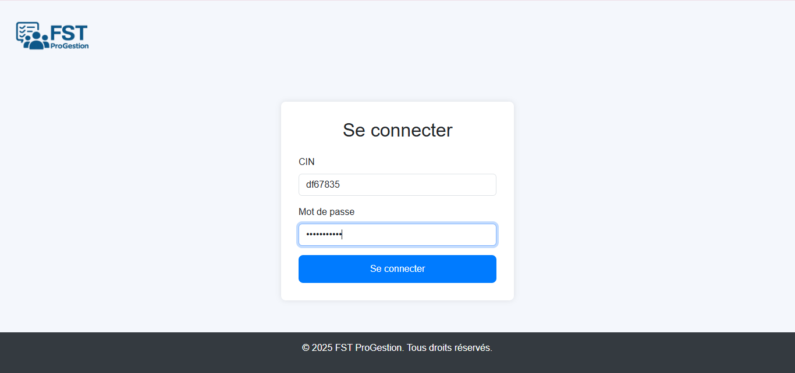
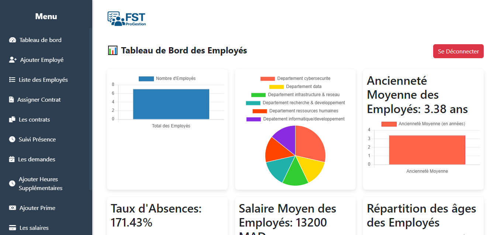
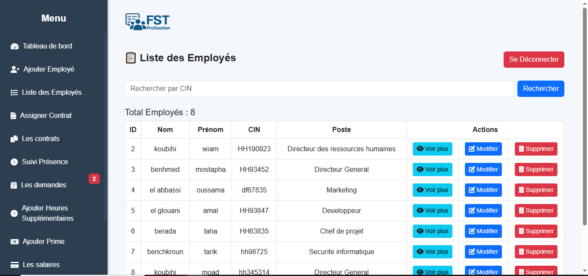
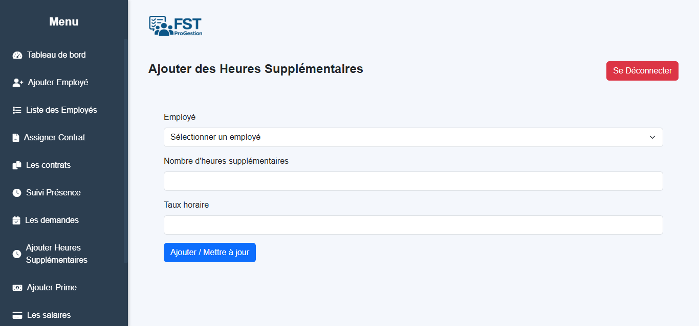

# Gestion des Employés et des Salaires

Application web de gestion des employés et de la paie, développée dans le cadre d'un projet de fin d'études.

L'application permet de centraliser la gestion des employés, des contrats, des présences, des congés ainsi que le calcul et le suivi des salaires.

## Fonctionnalités

###  Gestion des employés

* Ajouter un employé
* Consulter la liste des employés
* Consulter les détails d'un employé
* Modifier les informations d'un employé
* Gérer les employés supprimés

###  Gestion des contrats

* Ajouter et gérer les contrats
* Associer un contrat à un employé
* Gérer le salaire de base et les avantages

###  Gestion des présences

* Suivi des présences des employés
* Enregistrement du statut de présence
* Consultation du suivi mensuel

###  Gestion des congés

* Soumettre une demande de congé
* Consulter les demandes
* Approuver ou refuser une demande
* Gestion des statuts des demandes

###  Gestion des salaires

* Calcul du salaire net
* Gestion des primes
* Gestion des heures supplémentaires
* Gestion des retenues
* Prise en compte des absences
* Historique et archivage des salaires

###  Fiches de paie

* Génération des fiches de paie au format PDF
* Consultation des fiches de paie
* Archivage des fiches de paie

###  Authentification

* Système de connexion
* Gestion des rôles
* Gestion des mots de passe
* Accès adapté selon le type d'utilisateur

## Technologies utilisées

* **PHP**
* **MySQL**
* **HTML5**
* **CSS3**
* **JavaScript**
* **FPDF**
* **XAMPP**
* **Git & GitHub**

## Structure du projet

```text
gestion-employes-salaires/
│
├── Ajouter_employes.php
├── ConnectDb.php
├── afficher_contrat.php
├── afficher_salaires.php
├── ajouter_heures_supp.php
├── ajouter_prime.php
├── approuver_conge.php
├── archivage.php
├── bdd_projet.sql
├── change_password.php
├── conge.php
├── consulter_conge.php
├── contrat.php
├── dashbord.php
├── details_employe.php
├── employe_fiches_paie.php
├── employee_dashboard.php
├── employes_supprimes.php
├── gestion_conge.php
├── index.php
├── liste_employes.php
├── login.php
├── login_check.php
├── logout.php
├── salaire_fiche.php
├── suivi_presence.php
│
├── fpdf/
├── image/
├── logo/
│
├── bdd_projet.sql
├── .gitignore
└── README.md
```

## Installation

### 1. Prérequis

Avant de lancer le projet, installer :

* XAMPP
* PHP
* MySQL
* Un navigateur web

### 2. Installation du projet

Cloner le dépôt :

```bash
git clone https://github.com/koubihiwiam-pixel/gestion-employes-salaires.git
```

Placer ensuite le projet dans le dossier :

```text
xampp/htdocs/
```

### 3. Configuration de la base de données

1. Démarrer **Apache** et **MySQL** depuis XAMPP.
2. Ouvrir **phpMyAdmin**.
3. Créer une base de données nommée :

```text
bdd_2025
```

4. Importer le fichier :

```text
bdd_projet.sql
```

### 4. Connexion à la base de données

Vérifier la configuration dans `ConnectDb.php` :

```php
$host = "localhost";
$user = "root";
$password = "";
$db = "bdd_2025";
```

Adapter ces paramètres selon votre configuration MySQL.

### 5. Lancer l'application

Dans le navigateur :

```text
http://localhost/gestion-employes-salaires/
```

## Base de données

La base de données contient notamment les informations relatives :

* aux employés
* aux contrats
* aux présences
* aux congés
* aux salaires
* aux primes
* aux heures supplémentaires

Les données présentes dans la base sont des **données fictives utilisées uniquement à des fins de démonstration et de développement**.

## Sécurité

Pour une utilisation en production, il est recommandé de :

* utiliser des variables d'environnement pour les informations de connexion ;
* protéger les données sensibles ;
* renforcer la validation des données ;
* utiliser HTTPS ;
* renforcer la gestion des rôles et des permissions.
* 
##  Captures d'écran

###  Page de connexion


###  Dashboard


###  Liste des employés


###  Heures supplémentaires


###  Demande de congé


###  Fiche de paie


## Auteur

**Wiam Koubihi**

Projet réalisé dans le cadre de la formation en **Génie Logiciel**.

---

⭐ Si ce projet vous intéresse, n'hésitez pas à consulter le dépôt et à laisser vos suggestions.
